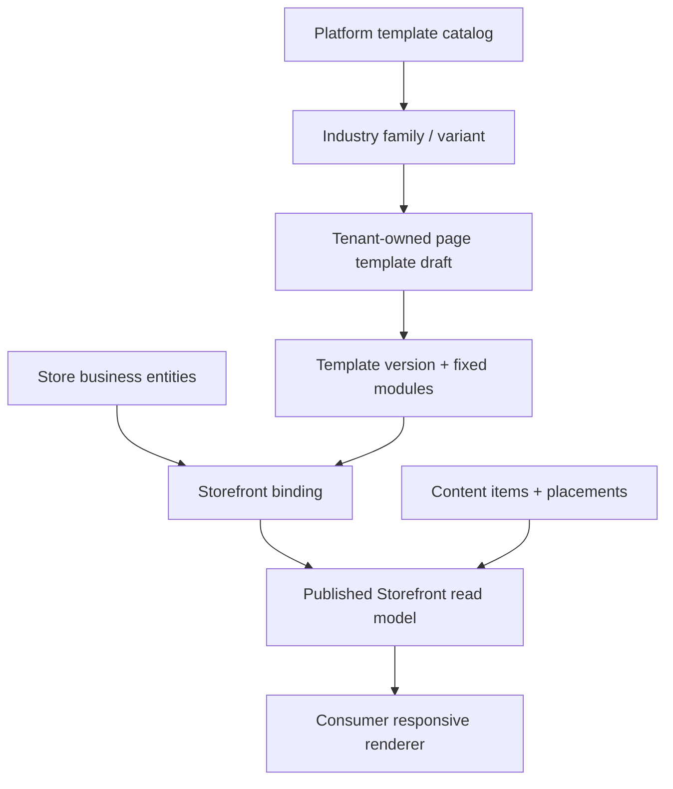

# ONEDAY V3 HIGH-FIDELITY TEMPLATE SYSTEM

> 冻结结论：应建立餐饮、美业、教育、新零售四套高保真行业模板，但它们是同一 Storefront Template Engine 的模板族，不是四套应用、更不是四份复制粘贴页面。

## 1. 现状与设计原则

现有 `page_templates/page_template_versions/page_modules` 已提供模板、草稿/发布版本、固定模块白名单（`hero/action_grid/content/result_list`）、位置与回滚；`industry_config` 已存在。Management Page Builder 只能列表、模块数据预览、发布/回滚。Consumer 店铺页独立读取门店业务表，当前 Banner、快捷入口与 tab 是前端硬编码。故模板能力“存在但未绑定”，不能以另建装修库解决。

原则：

1. 保留现有三层模板表为唯一布局版本真源。
2. 扩展固定模块，不做任意低代码/任意 HTML/脚本注入。
3. 模块配置只存视觉、可见性、顺序、引用；业务数据仍属于 Store、Service、Content、Benefit、Offer、Member 等领域真源。
4. 平台维护模板目录；租户实例化得到 tenant-owned draft；门店 binding 决定实际 Consumer 发布版本。
5. Preview 与 Published 必须调用同一 Consumer renderer，仅数据版本不同。

## 2. 模板层级与绑定

| 层                   | 责任                                                                         | 建议实现                                                                                              |
| -------------------- | ---------------------------------------------------------------------------- | ----------------------------------------------------------------------------------------------------- |
| Platform catalog     | 维护模板族、行业、版本、默认 token、允许模块、升级说明。                     | 扩展现有 Platform template 能力为 catalog metadata，不让 system template 直接被 Consumer 租户读取。   |
| Tenant template      | 租户可编辑的复制体与版本历史。                                               | 继续 `page_templates`，`target='consumer_storefront'` 或兼容现有 `consumer`；保留 `industry_config`。 |
| Storefront binding   | 一门店一个当前 live 绑定，绑定 template 和 published version，以及配置覆盖。 | 新增/扩展 binding（storeId、templateId、liveVersionId、draftVersionId、status、version）。            |
| Module               | 固定模块位置、视觉配置、业务 reference。                                     | 扩展 `page_modules.module_type/config` 白名单和 schema；不存实体副本。                                |
| Published read model | Consumer 高性能读、缓存版本、最小公开字段。                                  | 可由 binding + 领域表重建；不得作为可编辑真源。                                                       |

## 3. 固定模块目录

| 模块                 | 作用                                     | 允许引用                                            | 不允许                                            |
| -------------------- | ---------------------------------------- | --------------------------------------------------- | ------------------------------------------------- |
| `store_hero`         | 品牌/门店头部、封面、营业状态、主 CTA。  | Store identity/media、external action。             | 在 config 复制电话/地址/价格。                    |
| `banner_carousel`    | 1–5 个营销 Banner。                      | content/offer/action reference。                    | 任意 URL、未经审核内容、脚本。                    |
| `quick_actions`      | 4–10 个快捷入口。                        | internal route、external action、capability key。   | 前端硬编码动作；权限绕过。                        |
| `operating_channels` | 首页 + 最多三个行业频道 + 我的。         | channel capability key、visibility/order。          | 固定五 tab；超过上限。                            |
| `service_catalog`    | 服务/套餐/课程/商品目录。                | Store service/catalog query。                       | 把 SKU/库存直接写入 template JSON。               |
| `offer_compare`      | 多平台 Offer。                           | service + verified external action + offer record。 | 宣称未同步的实时价格。                            |
| `member_entry`       | 入会、等级/权益摘要。                    | Member policy/benefit query。                       | 在 enrollment 未实现前显示“已入会”。              |
| `content_feed`       | 动态、案例、活动、文章。                 | content placement query。                           | `store_content_items` 与 `content_items` 双真源。 |
| `store_info`         | 地址、营业时间、电话、地图、同商户门店。 | Store/merchant location。                           | 未记录的外部跳转。                                |
| `discovery_entry`    | 附近、商圈、渠道入口。                   | approved public placement。                         | pending/内部审批数据。                            |
| `member_wallet`      | 已领权益/核销码/历史。                   | member ledger，仅 Member identity。                 | 匿名展示 PII。                                    |

`hero/action_grid/content/result_list` 可向上述语义模块迁移兼容；旧模块不应被删除直到所有既有模板可解析。

## 4. 四套高保真模板族

| 模板族            | 视觉主题                               | 默认频道（最多 3） | 首页模块顺序                                                                                             | 商业核心                                      |
| ----------------- | -------------------------------------- | ------------------ | -------------------------------------------------------------------------------------------------------- | --------------------------------------------- |
| 餐饮 `restaurant` | 食欲色彩、沉浸菜品视觉、近场到店强调。 | 菜单、团购、会员。 | hero → banner → quick actions → offer compare → service catalog → member entry → content → store info。  | 到店、套餐、平台比价、门店切换。              |
| 美业 `beauty`     | 高信任、案例/服务前后对比、预约导向。  | 服务、案例、会员。 | hero → appointment action → quick actions → service catalog → content feed → member entry → store info。 | 咨询/预约、服务时长、员工/店长承接。          |
| 教育 `education`  | 清晰课程路径、成长与校区信任。         | 课程、活动、会员。 | hero → trial action → course catalog → content/feed → campus/store info → member entry。                 | 试听线索、课程服务、校区切换、家长隐私。      |
| 新零售 `retail`   | 商品/分类密度、活动和到店/配送动作。   | 商品、活动、会员。 | hero → quick actions → catalog → banner/activity → member entry → store/delivery info。                  | 目录、营销活动、外链/到店；SKU/库存后续接入。 |

四模板均必须同时提供 390、768、1024、1440 的设计稿/视觉回归基线。PC 是同一消费者体验的响应式布局：信息密度增加、详情可双栏、二维码可辅助，不新增横版路由或另一个内容模型。

## 5. 管理编辑与发布 UX

### Draft

- Tenant Owner/有 `storefront.draft` 权限的 Manager 在 Management 的“内容与装修”中选择门店和绑定模板。
- 编辑器只展示当前行业可用模块、配置表单、实体选择器、可见性和排序；业务对象 CRUD 跳转到其领域页，编辑后回填 reference。
- 每次保存产生/更新 draft version，使用 binding/template version 乐观锁；显示未发布改动和校验错误。

### Preview

- Preview URL 带短时、actor/store/draftVersion 绑定 token；渲染器与 Consumer Published 完全相同。
- 提供手机/平板/PC viewport 切换、空态/错误态模拟、公开/Member 模式模拟；不得把 Management 的 JSON 列表称为实时预览。

### Publish and rollback

- Publish 先验证所有引用：实体 active、外链安全、价格/权益合规、模块数量/频道上限、行业必需模块、可访问性。
- 原子切换 binding `liveVersionId` 后写 audit + `storefront.published.v1`；Consumer 只读取 live version。
- 失败不改变 live version；传播失败只重试读模型/缓存事件。
- Rollback 选择历史 published version，仍形成一次新发布记录和 Consumer 同步事件。

## 6. 内容、Offer、外链与 Member 的绑定规则

| 领域      | 真源                                                              | Storefront 使用方式                        | 当前迁移重点                                  |
| --------- | ----------------------------------------------------------------- | ------------------------------------------ | --------------------------------------------- |
| 门店资料  | `stores`/merchant location                                        | `store_hero`、`store_info` 读取。          | 补 Management 名称/地址等写路径；不复制。     |
| 服务/套餐 | `store_services`（后续扩展媒体/结构化价格）。                     | catalog/offer 模块按 query/ref 展示。      | 补 CRUD、媒体、状态/排序。                    |
| Offer     | `store_service_platform_offers` + enabled store external action。 | compare 模块只显示有效关联。               | 补后台维护与“价格来源/更新时间”声明。         |
| 外链      | `external_actions` + `store_external_actions`。                   | CTA/quick action 引用 actionId。           | 保留安全确认、tracking/audit。                |
| 内容      | `content_items` + Store placement。                               | banner/content feed 引用已发布 placement。 | `store_content_items` 迁为 placement 兼容层。 |
| 会员权益  | policy/enrollment/benefit ledger（新增）。                        | member entry/wallet 读取当前身份可用状态。 | `store_benefits` 只作为权益定义/展示基础。    |

## 7. 模板升级与兼容

- 每个 catalog template 声明 `schemaVersion`、支持模块、required modules、迁移函数与可回滚版本。
- 已开通 tenant 保持其当前 live version；平台模板升级只产生 upgrade draft，绝不静默重写商家已发布页面。
- Consumer renderer 至少兼容当前 `consumer-starter` 和旧四模块，直至迁移完成；无法解析则安全回退到上一 published version，并在 Management/Platform 告警。
- 模板 family 变更（如餐饮转零售）创建新 draft 和显式确认，不修改历史订单、客户、会员等业务语义。

## 8. 验收准则

一个高保真模板只有在以下都成立时才算“可交付”：

1. 可从 Provisioning 实例化为 tenant-owned template，并能绑定首店。
2. Draft/Preview/Publish/Rollback 使用同一 renderer；Consumer 确实读取已发布 binding。
3. 关键模块的业务引用来自唯一领域真源，后台保存后 Consumer 在同步 SLO 内可见。
4. 管理端不能配置非法外链、未批准内容、超过频道上限、无效服务或伪会员状态。
5. 四断点、loading/empty/error/forbidden、无障碍和低网速状态均有视觉/自动化证据。
