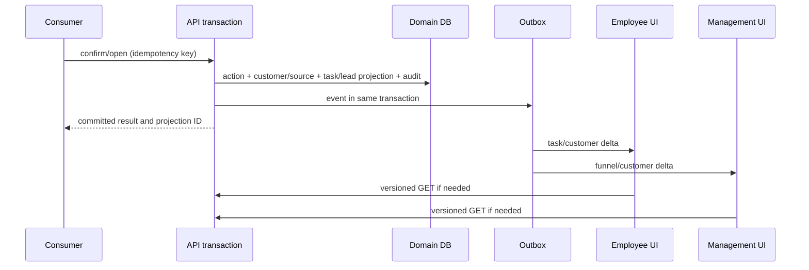
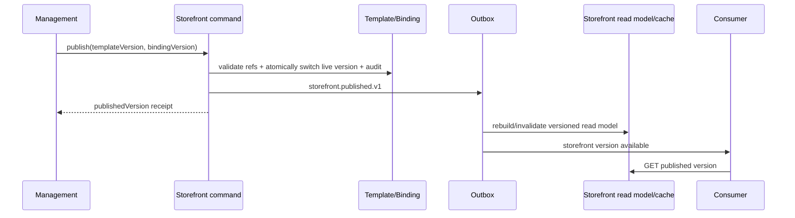

# ONEDAY V3 MULTI-TERMINAL SYNC SPEC

> 本规格区分“同库可读”“同事务投影”“异步事件传播”“实时 UI 更新”。当前只完整具备前两类的一部分和内部 Outbox 消费；后两类需要正式建设。

## 1. 同步目标与非目标

目标是让 Consumer、Employee、Management、Platform 在同一 tenant、store、role/scope 下看到可解释、可恢复的一致业务状态；所有可见变化均有版本、来源和延迟 SLO。它不是把所有数据库表镜像到所有终端，也不是让 Worker 的 `published` 状态等同外部平台投递成功。

非目标：在本阶段构建通用消息中台、无限离线同步、支付库存 ERP、第三方平台实时价格同步。外部连接器仍必须明确区分“已记录授权意图”和“已完成外部交付”。

## 2. 当前已实现的真实同步

| 场景                                         | 一致性级别                       | 已实现事实                                                                                          | 缺口                                                                                           |
| -------------------------------------------- | -------------------------------- | --------------------------------------------------------------------------------------------------- | ---------------------------------------------------------------------------------------------- |
| Consumer 咨询/外链确认 → Employee/Management | 强一致写入。                     | 公开动作、audit、Outbox、customer/source、owner+task 或 lead pool 在一个 DB transaction；幂等投影。 | 无 Web push；员工/管理端依赖下一次读取/刷新。                                                  |
| Employee 跟进/结果/证据 → Management         | 共享真源读取。                   | 同 tenant 数据和审计/Outbox 已有；Management 可见经营链。                                           | 无统一 read-model version/订阅/时效契约。                                                      |
| 门店电话/导航 → 运营留痕                     | 异步事件可用，核心留痕已写入。   | outbound event、audit、Outbox。                                                                     | 不投影为可订阅的管理指标。                                                                     |
| Page Template publish → Consumer             | 仅有模板版本切换。               | Page Template 有 draft/publish/rollback/Outbox。                                                    | Consumer 不消费模板；无 binding、缓存失效、预览版本。                                          |
| Content publish → Consumer                   | 未实现。                         | Management content 有 draft/approve/distribution intent。                                           | `store_content_items` 独立；Consumer 不读 `content_items`。                                    |
| Tenant suspended → Consumer                  | 公共入口即时读取 tenant active。 | public consumer services 查询 active tenant。                                                       | 已登录 E/M/P 无 tenant lifecycle 会话收敛。                                                    |
| RBAC change → UI/API                         | 部分即时。                       | 每个 API 授权会重新查 membership/role permission。                                                  | access token/session 无 permission epoch；菜单无主动刷新/广播，部分业务范围未统一。            |
| Channel/Circle change → Consumer             | 未实现。                         | 平台/商圈成员状态、approval、display config 和 Outbox 已有。                                        | Consumer discovery 读的是另一套 `business_circles`/`business_circle_merchants`；没有投影规则。 |
| Worker/Outbox                                | 可靠内部消费账本。               | `FOR UPDATE SKIP LOCKED`、event consumption 去重、退避、last_error、任务提醒/逾期。                 | handler 当前为空实现；无 dead-letter policy、业务订阅、端到端观测。                            |

## 3. 一致性模型冻结

### 3.1 写入模型

每一个 command 在一个 tenant transaction 内完成：领域真源写入 + audit + version + outbox。`correlationId` 横贯 Run/command，`traceId` 标识处理链，`idempotencyKey` 只保护同一 command 的重复提交。

### 3.2 读模型

- **强一致读取**：命令响应必须返回刚写入的版本；Employee/Management 随后的 API GET 读同一数据库真源，允许直接读。
- **发布读模型**：Storefront、Consumer discovery、跨端 dashboard 等可缓存/投影，但必须有 `aggregateVersion`/`publishedVersion` 和可回源重建能力。
- **隐私边界**：Consumer 读模型绝不包含员工、内部审批、线索池、权限、内部外链凭据；Employee 读模型绝不包含不在 scope 的 customer/member 数据。

### 3.3 通知传输

增加“事件订阅网关”而非让浏览器轮询 outbox：优先 SSE（单向、低复杂度），必要时 WebSocket；每个订阅需 authorization、tenant/scope filter、lastEventId 续传、版本去重和短期重连。失败时退化为带 ETag/version 的 30 秒轮询，并显示“正在更新/可刷新”。

## 4. 领域事件合同

所有 event 名以 `.v1` 结束；payload 必须至少包含 `schemaVersion`、`occurredAt`、`tenantId`、`aggregateId`、`aggregateVersion`、`correlationId`、`actorType`，且仅发送接收方许可字段。

| 事件                                             | 产生方/真源                   | 消费者                                     | 同步动作                                                              | SLO                           |
| ------------------------------------------------ | ----------------------------- | ------------------------------------------ | --------------------------------------------------------------------- | ----------------------------- |
| `consumer.action.*.v1`                           | consumer action event         | operating projection、Employee、Management | 当前投影保留同事务；订阅发送 task/customer delta。                    | 命令提交立即；UI p95 5s。     |
| `consumer.operating.projected.v1`                | consumer operating projection | Employee、Management                       | 任务/线索池/客户列表失效。                                            | p95 5s。                      |
| `employee.task.*.v1` / `evidence.*.v1`           | task/follow-up/evidence       | Management、Employee                       | 任务状态、客户时间线、绩效失效。                                      | p95 5s。                      |
| `storefront.draft.saved.v1`                      | Storefront binding draft      | Management preview only                    | 同一浏览器 preview version 更新；不发 Consumer public topic。         | p95 2s。                      |
| `storefront.published.v1` / `rolled_back.v1`     | binding live version          | Consumer、Management、Platform             | 失效 Storefront cache，推送 publishedVersion，记录 delivery receipt。 | p95 10s / max 60s。           |
| `content.published.v1` / `placement.changed.v1`  | content entity/placement      | Storefront projection、Consumer            | 重新解析引用内容；不把 external distribution 当 publish。             | p95 10s。                     |
| `member.enrollment.*.v1` / `member.benefit.*.v1` | enrollment/ledger             | Consumer Member、Employee、Management      | 身份/权益账本/核销视图更新。                                          | 命令立即；UI p95 5s。         |
| `tenant.lifecycle.changed.v1`                    | tenant lifecycle              | Auth/session gateway、all terminals        | active/suspended 立即授权收敛、撤销/标记 session、清理 public cache。 | API immediately; UI p95 60s。 |
| `rbac.changed.v1` / `scope.changed.v1`           | role/membership/scope         | Auth/session gateway、E/M/P                | 增加 permission epoch；刷新菜单和受保护资源；高危降权立即拒绝。       | API immediately; UI p95 60s。 |
| `channel.merchant.*.v1`                          | Channel relation/provisioning | Platform/Channel                           | 更新交付 Run；不直接公开。                                            | p95 10s。                     |
| `circle.membership.*.v1`                         | Circle membership             | Consumer discovery projection              | 仅 approved + visible 时加入/移除 Consumer collection。               | p95 10s / max 60s。           |
| `outbox.delivery.failed.v1`                      | Worker                        | Platform observability                     | 重试、阈值后进入 dead-letter/人工队列。                               | 立即记录。                    |

当前已有事件可在兼容层映射到上述名称；不要破坏现有 audit/outbox 证据。事件的“delivery status”必须区分 internal consumed、projection applied、subscriber notified、external delivered。

## 5. 核心时序

### 5.1 Consumer 行为到 Employee/Management

API 返回前不得只写 Outbox 而不写经营投影；否则 Consumer 成功、Employee 无任务会破坏当前已验证链路。

### 5.2 Management 装修发布到 Consumer

如果 R 未在 60 秒内确认，Platform/Management 必须显示发布传播失败并支持安全重试；不得回滚已原子发布的业务真源，除非操作员显式回滚版本。

## 6. Tenant 禁用、会话和权限收敛

冻结规则：tenant status 是所有 product endpoint 的授权前置条件；不是仅 Consumer 查询过滤条件。认证/授权查询必须验证 tenant active，或在状态变更时对该 tenant 的 auth sessions 批量 revoke + `tenant_auth_epoch` 增加。两者建议同时做：每请求轻量 epoch/status 校验保证安全，事件用于 UI 体验和缓存清除。

| 变化                 | API 立即行为                                                                        | 异步行为                                                 | 用户可见结果                                    |
| -------------------- | ----------------------------------------------------------------------------------- | -------------------------------------------------------- | ----------------------------------------------- |
| suspend tenant       | Consumer 公开读/写返回不可用；E/M/P 受保护请求 403/tenant suspended；refresh 失败。 | 撤销会话、删除订阅、清 public cache、发 platform audit。 | 下次请求立即登出/提示；60 秒内所有在线端收到。  |
| reactivate tenant    | 仅 Platform 完成 READY/风险校验后放行。                                             | 失效 cache、允许重新登录。                               | 不自动恢复旧外部链接/权限，须按策略复核。       |
| 删除 role permission | 授权立即拒绝。                                                                      | permission epoch、菜单/订阅 topic 刷新。                 | 当前页切到 forbidden 或只读，不保留可提交草稿。 |
| store scope removed  | scope decision 立即拒绝对应数据。                                                   | 清理 scoped cache/topic。                                | 引导回可访问门店/首页。                         |

## 7. Channel/Circle 到 Consumer 的映射

当前 Platform Channel/Circle 是 system tenant 的运营对象，而 Consumer discovery 读取 tenant 内的 `discovery_channels` / `business_circles`。冻结为显式 projection，禁止跨表无审计复制：

- Channel merchant `active + ready` 可产生 tenant discovery placement（若租户主动启用），但仅发送店铺公开资料；失败/paused 立即移除公开 placement。
- Circle membership 只有 `circleApproval=approved AND platformApproval=approved AND displayConfig.visible=true AND tenant active AND store active` 才产生 Consumer circle placement。
- `displayConfig.sortOrder/headline` 是 Consumer 展示投影输入；邀请说明、审批备注、exit reason、内部 operator 不得下发。
- 所有 projection 行记录 source aggregate/version；source 变为不可见时可幂等撤回。

## 8. Worker、恢复与可观测性

保留现有 `SKIP LOCKED`、消费去重、15 秒线性退避（上限 8）和 `last_error`。新增：

- 每个 handler 显式注册、版本兼容和契约测试；空 handler 不能算业务同步。
- 超过阈值进入 dead-letter/`needs_attention`，显示 aggregate、tenant、event、attempt、error、correlation，不泄露 payload 中敏感字段。
- 可从 Platform 安全重放单一 event；重放仍依赖 `event_consumptions` 幂等和投影版本。
- 指标：outbox pending age、retry count、dead-letter count、projection lag、subscription lag、cache version mismatch、tenant lifecycle propagation lag。
- 恢复演练：Worker 中断、重复投递、顺序颠倒、缓存未失效、订阅断线、权限/tenant status 变化期间正在提交 draft。

## 9. 版本、冲突和缓存规则

- 所有可编辑 aggregate 使用现有 `version` 乐观锁；Storefront binding、content placement、membership ledger 同样如此。
- Consumer 永远读一个完整 `publishedVersion`；不得读取半更新的模块列表。
- 客户端保存 `lastSeenVersion`；收到低版本通知丢弃，收到间隔版本则 GET 详情。
- Preview token 仅指向 draft version，短时有效、tenant/store/actor 绑定，不得被匿名 Consumer URL 使用。
- ETag/Cache-Control 必须按 tenant/store/publishedVersion 变化；tenant suspend/role scope 事件清除私有和公开缓存。

## 10. 验收 SLO

| 指标                                                      |                P95 | 最大/处置                                  |
| --------------------------------------------------------- | -----------------: | ------------------------------------------ |
| Consumer action committed to Employee/Management API read |     事务返回即成立 | 0 个孤儿 action；失败整体回滚。            |
| 在线 Employee/Management UI task delta                    |               5 秒 | 30 秒后自动 versioned refresh；超时告警。  |
| Storefront/content publish visible on Consumer            |              10 秒 | 60 秒；标记 propagation failure 并可重试。 |
| Channel/Circle public placement update                    |              10 秒 | 60 秒；期间不泄露未批准记录。              |
| Tenant suspension / permission downgrade API denial       |               即时 | 不允许依赖 access token 到期。             |
| Tenant suspension / permission UI convergence             |              60 秒 | 断线重连后首请求必收敛。                   |
| Outbox retry detection                                    | 1 个 poll interval | 达阈值 dead-letter + Platform alert。      |
