# ONEDAY V3 TENANT ONE-CLICK PROVISIONING SPEC

> 目标：把“平台一次提交创建基础记录”升级为可恢复、可审计、可验证、可交付的 **Tenant READY** 编排。
> 本文冻结未来实现，不改动当前 `PlatformOnboardingService`。

## 1. 当前实现与结论

当前 `/api/v1/platform/onboarding` 是一个有价值的基础事务：校验、幂等、冲突回滚后创建 tenant、管理员 user/membership、HQ、merchant、首店、`tenant_admin`、`tenant.manage`、一个 `consumer-starter` `page_template`，并写 audit/Outbox。它没有创建模板版本和模块，没有 `published_version_id`，也没有 Storefront binding；因此 Consumer 无法因该模板而呈现店铺。它没有套餐/权益/内容、员工工作台准备、渠道/商圈绑定、二维码、登录激活、发布、健康检查或 READY 状态。

结论：当前能力应命名为 **基础租户初始化（PARTIAL）**，不能命名为“一键开通租户”。渠道商户开通是相似但不一致的第二条初始化路径：它额外创建 `platform_tenant_settings`、channel merchant 关联，并给管理员 `tenant.manage + employee.manage`，但同样没有 READY。

## 2. 单一编排边界

冻结为一个领域对象 `tenant_provisioning_runs`，由 Platform 发起；Channel 是同一编排的 source mode，不再拥有一套独立租户初始化语义。

| 字段/概念       | 规则                                                                                                                                                     |
| --------------- | -------------------------------------------------------------------------------------------------------------------------------------------------------- |
| `runId`         | 一次商业开通的稳定 UUID；所有子步骤共用 correlationId。                                                                                                  |
| idempotency key | `platform + requested tenant slug + request key`；重复请求返回同一 Run，而不是只返回部分资源。                                                           |
| mode            | `platform_direct`、`channel_referral`；只影响归因、交付人和默认模板/套餐，不改变基础资源模型。                                                           |
| state           | `draft → validating → provisioning → awaiting_activation → ready`；失败为 `failed_recoverable` 或 `failed_terminal`；人工暂停为 `blocked`。              |
| step state      | `pending/running/succeeded/failed/skipped/compensated`，逐步保存 attempt、startedAt、endedAt、errorCode、output reference。                              |
| READY           | 仅在所有必需步骤成功、Consumer Published Storefront 可读、Owner 可登录且角色有效、Employee/Management 可进入、二维码可解析、Worker/Outbox 无阻塞时达到。 |
| 事务策略        | 创建不可分的基础身份/组织/门店/角色数据使用一个事务；可重试的发布、二维码、缓存预热、通知使用 Outbox saga。绝不以一个跨服务长事务伪装原子性。            |

## 3. 输入合同

| 输入组     | 必填                                                                                   | 规则                                                                                         |
| ---------- | -------------------------------------------------------------------------------------- | -------------------------------------------------------------------------------------------- |
| 租户       | slug、tenantName、industry、plan                                                       | slug 全局唯一；industry 仅 `restaurant/beauty/education/retail`；plan 决定 quotas/可用模块。 |
| 主体与首店 | organizationName、merchantName、storeName、address、phone、coordinates、business hours | 初始 Storefront 必需最小门店身份；地址/坐标允许待补，但 READY 前须达到行业最小资料规则。     |
| Owner      | name、email/phone、activation mode                                                     | 不在平台操作员浏览器长期保存明文密码；使用一次性激活令牌或企业 SSO 邀请。                    |
| 模板       | templateFamily、themeVariant、selected channels                                        | 选择四行业目录模板，生成 tenant-owned draft，再进行 Storefront binding 发布。                |
| 渠道/商圈  | sourceChannel 可选、circle requests 可选                                               | Channel 仅创建归因/交付；Circle 必走独立邀请和双审批，未批准不阻塞基础 READY。               |
| 交付       | domain/short link policy、QR scenes、operator note                                     | 生成 Consumer Storefront、Employee 入职/分享、Management 登录三类二维码/链接。               |

## 4. 必需步骤与编排顺序

```mermaid
flowchart LR
  A[Validate and reserve slug] --> B[Create tenant foundation]
  B --> C[Create Owner and role packs]
  C --> D[Create org merchant first store]
  D --> E[Instantiate industry template]
  E --> F[Bind storefront and publish v1]
  F --> G[Initialize Member and Employee defaults]
  G --> H[Attach channel / submit circle request]
  H --> I[Generate QR and delivery links]
  I --> J[Verify access, worker, storefront]
  J --> K[READY]
```

| #   | 编排步骤                 | 当前状态                          | 冻结的完成条件                                                                                                             |
| --- | ------------------------ | --------------------------------- | -------------------------------------------------------------------------------------------------------------------------- |
| 0   | Validate/Reserve         | 部分：slug/email 冲突在事务内查。 | schema、套餐配额、行业、模板、渠道、地址、同名回放均校验；Run 创建。                                                       |
| 1   | Tenant Foundation        | 已有。                            | tenant active、platform settings、审计、基础数据范围与默认 operating settings。                                            |
| 2   | Owner/Role Packs         | 部分。                            | 创建 Owner、Tenant Manager、Store Manager、Employee 的系统角色模板；Owner 得到一致的 owner pack，不是随机 `tenant_admin`。 |
| 3   | Org/Merchant/First Store | 部分。                            | HQ/merchant/store + 地址、坐标、电话、营业时间、店长候选范围。                                                             |
| 4   | Industry Template        | 未完成。                          | 从平台目录复制版本和固定模块，创建 tenant-owned draft，写 `industry_config`。                                              |
| 5   | Storefront Publish       | 未完成。                          | 创建 `storefront_binding`，同一 Consumer renderer Preview 通过后发布 V1；`published_version_id` 非空且 API 可读。          |
| 6   | Commercial defaults      | 未完成。                          | 每个行业最小服务/权益/内容/动作（仅合法演示或商家输入）以及 Member policy、Employee workspace policy；不得依赖测试 seed。  |
| 7   | Channel/Circle           | 部分且分裂。                      | Channel source/membership 写入；Circle 只创建 pending request，双审批后才对 Consumer 可见。                                |
| 8   | QR/Delivery              | 未完成。                          | Consumer Storefront、Owner activation、Employee share/onboarding 三类短链/二维码可解析、可撤销、可追踪。                   |
| 9   | Activate/Verify          | 未完成。                          | Owner 激活或邀请已送达；四端权限检查、Consumer published read、Worker/Outbox、缓存预热、健康检查成功。                     |
| 10  | READY/Hand-off           | 未完成。                          | Run 进入 ready，产生交付包和可重复的验收结果；否则明确阻断原因。                                                           |

## 5. 四行业模板选择规则

| 行业   | 默认 Consumer 频道 | 初始必需模块                                           | 初始运营对象                                   |
| ------ | ------------------ | ------------------------------------------------------ | ---------------------------------------------- |
| 餐饮   | 菜单、团购、会员   | hero、快捷入口、套餐/Offer、门店信息、会员权益、内容。 | 服务/套餐、外部平台 link、到店/电话动作。      |
| 美业   | 服务、案例、会员   | hero、预约/咨询、服务卡、案例内容、权益、门店信息。    | 服务时长、技师/员工路由预留、预约动作。        |
| 教育   | 课程、活动、会员   | hero、课程、试听咨询、师资/内容、校区、权益。          | 课程服务、试听线索、校区切换。                 |
| 新零售 | 商品、活动、会员   | hero、分类快捷入口、商品/活动、到店/配送动作、权益。   | SKU/库存为后续域；V1 先以结构化目录/行动承接。 |

模板只提供版式、配置默认值和最小示例，不得生成虚假的价格、库存、第三方实时价格、可用会员权益或已送达外部连接器。

## 6. 失败、恢复与人工边界

| 情况                      | 系统动作                                                                       | 可重试                       | 不得做                            |
| ------------------------- | ------------------------------------------------------------------------------ | ---------------------------- | --------------------------------- |
| slug/email 冲突、输入无效 | validation failed，不写业务资源。                                              | 修正后新 Run 或同 Run 修订。 | 不猜测覆盖已有 tenant/user。      |
| 基础事务失败              | 回滚所有基础资源，Run 记录失败原因。                                           | 同 key 安全回放。            | 留下半租户且显示成功。            |
| 模板发布/二维码失败       | 基础 tenant 保留为 provisioning/blocked，步骤可幂等重试。                      | 是。                         | 标 READY 或人工改数据库绕过。     |
| Owner 未激活              | `awaiting_activation`，Consumer 可按产品策略 draft/private；不能对外宣告上线。 | 邀请重发/撤销。              | 以平台操作员密码代替 Owner 激活。 |
| Circle 审批未完成         | 基础 READY 可成立，但 circle exposure 为 pending。                             | 审批流程重试。               | 未经双审批显示到 Consumer。       |
| 配额/套餐不足             | failed_recoverable/blocked。                                                   | 调整套餐后从失败步骤继续。   | 超额创建后再静默限制。            |

## 7. READY 机器可验收清单

`ready` 必须同时输出下列可查询断言，而不是仅显示一条成功消息：

- tenant active、plan/quotas 与 Run 输入一致；唯一 Owner membership/role pack active；Owner 激活可登录。
- 至少一个 active organization、merchant、store；店铺的行业最小资料齐全。
- Storefront binding 指向一个 published template version，Consumer published API 只返回该版本；Preview 和 Published URL 的版本可区分。
- 所有模板引用的服务、内容、权益、外链都存在且状态可用；不存在 seed-only 依赖。
- Management、Employee、Consumer（匿名/Member 如适用）入口返回预期状态；低权限和跨 tenant 返回拒绝。
- QR/短链能解析 tenant/store/scene/source，不泄露内部 ID 或敏感 token；撤销可生效。
- `outbox_events` 没有该 Run 的永久 pending/last_error；Worker health recent；读模型/缓存版本一致。
- Run、每步、审计、Outbox、交付链接与验收记录均按 correlationId 可追溯。

## 8. 与现有实现的迁移原则

- 保留 `PlatformOnboardingService` 的字段验证、事务、幂等、审计和 Outbox 写法，收敛为 Provisioning 的 foundation step。
- 保留 `ChannelMerchantOnboardingService` 的 Channel 关系和 delivery 数据，但把 tenant 创建委托到同一 provisioning command；修正两入口 Owner 权限不一致。
- 保留 `page_templates`，但开通时必须创建版本/模块并通过 binding 发布；不另建“starter 页面 JSON”。
- READY 完成前，平台租户列表显示 provisioning 状态和失败步骤；不得把 tenant `active` 单独解释为可交付。
